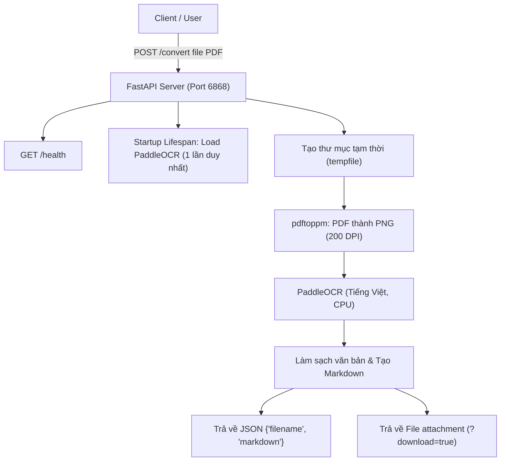

# Tài liệu thiết kế hệ thống

## 1. Mục đích và phạm vi

Dự án chuyển đổi một tệp PDF thành định dạng Markdown bằng nhận dạng ký tự quang học (OCR). Mỗi trang PDF được kết xuất thành ảnh, PaddleOCR nhận dạng văn bản tiếng Việt trên ảnh, sau đó ứng dụng tổng hợp kết quả thành văn bản Markdown.

Hệ thống đã được nâng cấp từ chương trình batch chạy 1 lần sang **API Server liên tục** phát triển trên nền **FastAPI** và **Uvicorn** chạy trong Docker container. Khách hàng/người dùng có thể gửi file PDF thông qua HTTP POST request (chức năng upload file) và nhận về nội dung Markdown ở dạng JSON hoặc tải file `.md` về trực tiếp.

## 2. Thành phần

| Thành phần | Vai trò |
| --- | --- |
| `docker-compose.yml` | Build và chạy container `paddleocr-api`; mở cổng `6868:6868`; mount các thư mục input/output. |
| `Dockerfile` | Tạo môi trường Python, cài dependencies hệ thống (`poppler-utils`, `libgl1`), thư viện ứng dụng, `EXPOSE 6868` và chạy Uvicorn. |
| `requirements.txt` | Khai báo PaddleOCR, FastAPI, Uvicorn, python-multipart và các thư viện hỗ trợ. |
| `app/main.py` | Ứng dụng FastAPI định nghĩa API endpoints (`/convert`, `/health`), quản lý model OCR và pipeline xử lý PDF → ảnh → OCR → Markdown. Đồng thời hỗ trợ chế độ CLI fallback. |
| `input/` | Chứa file mẫu hoặc dữ liệu đệm trên host (được mount vào container). |
| `output/` | Thư mục lưu kết quả xuất file trên host (được mount vào container). |

## 3. Sơ đồ xử lý API

## 4. Luồng hoạt động

### 4.1. Khởi động Server (Startup)
1. Chạy lệnh `docker compose up --build`.
2. Container `paddleocr-api` khởi chạy Uvicorn server lắng nghe tại port `6868`.
3. Thông qua cơ chế **lifespan** của FastAPI, ứng dụng khởi tạo duy nhất 1 instance `PaddleOCR` (ngôn ngữ `vi`, góc quay `use_angle_cls=True`, `use_gpu=False`). Model được load sẵn vào bộ nhớ RAM, tránh việc phải load lại model cho từng request.

### 4.2. Xử lý Request Upload File (`POST /convert`)
1. Client gửi request `POST /convert` đính kèm file PDF (`multipart/form-data`).
2. API Server kiểm tra tính hợp lệ của file (định dạng `.pdf`). Nếu sai định dạng, trả về lỗi `HTTP 400 Bad Request`.
3. Hệ thống tạo một thư mục tạm độc lập (`tempfile.TemporaryDirectory`) cho request hiện tại.
4. File PDF được lưu vào thư mục tạm và hàm `pdf_to_images` gọi `pdftoppm` để tách các trang PDF thành ảnh PNG (200 DPI).
5. Tiến trình OCR đọc từng trang ảnh từ bộ nhớ/thư mục tạm, nhận dạng văn bản tiếng Việt và trả về chuỗi văn bản đã làm sạch.
6. Ứng dụng tổng hợp toàn bộ các trang thành định dạng Markdown (gồm Tiêu đề file & tiêu đề `## Trang N`).
7. Tùy thuộc vào tham số query `download`:
   - `download=false` (mặc định): Trả về JSON chứa `filename` và `markdown`.
   - `download=true`: Trả về file kết quả đính kèm `.md` để client tải về.
8. Thư mục tạm và các trang ảnh trung gian tự động bị xóa sau khi hoàn thành request.

## 5. PaddleOCR và Quản lý Bộ nhớ / Cache

- **Thư viện Python:** `paddleocr==2.9.1`, `fastapi`, `uvicorn[standard]`, `python-multipart` được cài qua `pip install -r requirements.txt`.
- **PaddlePaddle Base Image:** Image cơ sở `paddlepaddle/paddle:2.6.2`.
- **Model OCR Lifespan Cache:** Trọng số model được tải khi khởi động server và lưu trong bộ nhớ RAM của tiến trình FastAPI. Cache file của model được PaddleOCR lưu trong thư mục `$HOME/.paddleocr/` của container.
- **Tối ưu năng suất:** Việc giữ sẵn instance `PaddleOCR` trong bộ nhớ trong suốt vòng đời của server giúp giảm thời gian phản hồi API xuống chỉ còn thời gian thực thi OCR cho các trang ảnh.

## 6. Lưu trữ Dữ liệu và Thư mục Tạm

| Dữ liệu | Vị trí / Cơ chế lưu trữ | Thời gian tồn tại |
| --- | --- | --- |
| File PDF Upload | Thư mục tạm `tempfile.TemporaryDirectory()` trong container | Chỉ tồn tại trong suốt quá trình xử lý request, tự động dọn dẹp sau khi phản hồi. |
| Ảnh trang trung gian | Subfolder `_pages` nằm trong thư mục tạm | Tự động xóa cùng thư mục tạm. |
| Model PaddleOCR đã tải | Thư mục `$HOME/.paddleocr/` trong container | Giữ trong container xuyên suốt quá trình chạy server. |
| File xuất ra (CLI Mode) | `/app/output/` (bind mount từ `./output`) | Tồn tại trên máy host ngay cả khi dừng container. |

## 7. Cấu hình API Endpoints

- **`GET /`**: Trả về thông tin chào mừng và danh sách các endpoint khả dụng.
- **`GET /health`**: Endpoint health-check (trả về `{"status": "healthy"}`).
- **`POST /convert`**: Endpoint upload file PDF.
  - Body: `file` (`UploadFile`, bắt buộc).
  - Query param: `download` (`bool`, mặc định `false`).
- **`GET /docs`**: Giao diện thử nghiệm Swagger UI tương tác.

## 8. Xử lý Lỗi và Giới hạn

- **Tệp không hợp lệ:** Trả về HTTP Status `400 Bad Request` nếu file tải lên không phải định dạng PDF.
- **Lỗi xử lý PDF / OCR:** Nếu tiến trình chuyển đổi PDF hoặc OCR gặp sự cố, hệ thống bắt ngoại lệ và trả về `HTTP 500 Internal Server Error` đi kèm thông tin lỗi ngắn gọn mà không làm dừng/crash API server.
- **Giới hạn hiện tại:**
  - OCR xử lý tuần tự từng trang ảnh trên CPU.
  - Văn bản đầu ra là Markdown tuyến tính theo các dòng nhận diện, chưa hỗ trợ tái tạo bố cục bảng biểu phức tạp hoặc đa cột.
